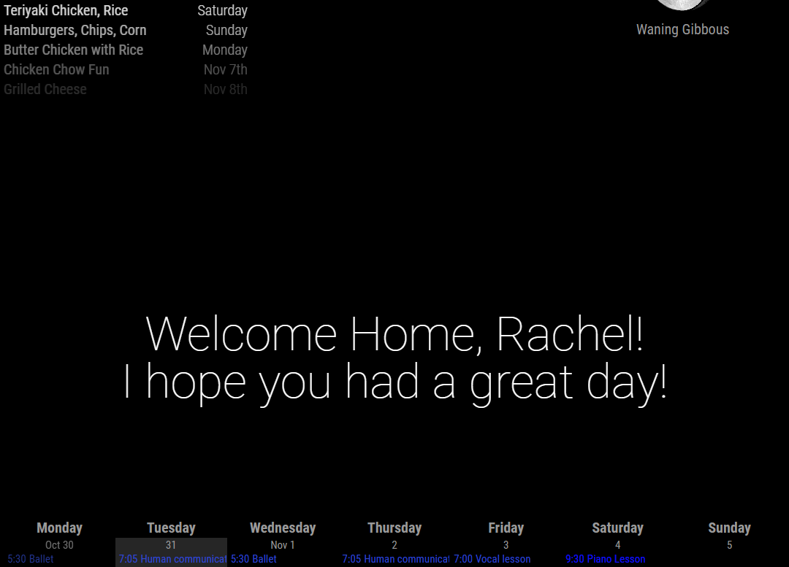

# MMM-MailMessage

MMM-MailMessage is a module for the MagicMirror² project by Michael Teeuw. It allows you to display messages sent in the subject line of an e-mail message. This means that approved users can post a message on the mirror from anywhere they have access to their e-mail.

## Screenshot


Note that this example shows messages from two separate e-mails.


This message was sent with a warning modifier (see the Usage section below).

## Installation

Clone the MMM-MailMessage repository:

```shell
cd ~/MagicMirror/modules
git clone https://github.com/Unclearogre/MMM-MailMessage
```

Next, get the dependencies:

```shell
cd ~/MagicMirror/modules/MMM-MailMessage
npm install
```

## Configuration

To use MMM-MailMessage, add it to the modules array in the config/config.js file of your MagicMirror² installation:

```js
    {
         module: 'MMM-MailMessage',
         position: 'middle_center',
         header: 'E-mail - Mirror Messages',
         config:{
             user: 'MMemail@mydomain.com',
             pass: 'password',
             host: 'mail.mydomain.com',
             port: 993,
             subjectlength: 50,
             validSenders: [ { addr: "dad@mydomain.com",  name: "Dad",  color: "#00ff00" },
                             { addr: "mom@mydomain.com",  name: "Mom",  color: "#ff0000" },
                             { addr: "son@mydomain.com",  name: "Billy" },
                             { addr: "nana@mydomain.com", name: "Nana"  }
             ],
             daysToDisplay: 0,
             msgsToDisplay: 2,
             colorText: "#0000ff"
         }
    },
```

It probably works best in one of the full-width sections (top_bar, bottom_bar, upper_third, middle_center, and lower_third) but you do you, boo.

In addition, you will need an e-mail address to which messages can be sent. Having my own domain name with unlimited e-mail addresses available to me, I simply created one that made sense to me in this context. It could, however, very easily be an e-mail account with Google, Yahoo, or any other free service that allows for imap message access.

## Usage

To add a message to your MagicMirror², send an e-mail to the specified e-mail address with the message in the subject line. Note that the body of the e-mail is ignored by this module.

If the subject line starts with one of the allowed modifiers, the color of the message will be changed accordingly. At this time, the modifers are:
| Modifier | Symbol Name | Meaning | Default Color |
| ------- | --- | --- | --- |
| ! | Exclamation Point | Important Message | #ff0000 (Red) |
| + | Plus Sign | Good News | #00ff00 (Green) |
| * | Asterisk | Warning | #ffcc00 (Yellow) |

In addition to the modifiers, the duration of the message can be overridden by including a number of days and minutes at the start of the message subject. Note that this time cannot be longer than the duration set in the config file. That is, if the config file is set for messages to display for 1 day, then an individual message cannot exceed that limit.

The syntax for the duration is **[dd:mmmm]** where _dd_ is the number of days and _mmmm_ is the number of minutes. So, to have a message display for one and a half days (36 hours), you would use **[1:720]**. For a message that would last 45 minutes, use **[45]**. Note that the days parameter is optional but if included, it must be followed with a colon. Leading zeroes are not required. Days can be a maximum of 99 and minutes can be a maximum of 9999. Again, however, note that this duration cannot exceed the duration set in the config file via the daysToDisplay and minsToDisplay options.

## Configuration Options

| Option  | Description | Type | Default |
| ------- | --- | --- | --- |
| user | E-mail address where messages are to be sent. Must be a valid e-mail address such as "<youremail@yourdomain.com>". | String | Required |
| pass | Password for the e-mail address. | String | Required |
| host | The address of the mail server. Although my hosting service's documentation said I should use "mail.mydomain.com", I had to use "mail.theirdomain.com" after seeing errors on the console when trying to retrieve e-mail. | String | Required |
| Port | The port your host uses for imap access. | Integer | 993 |
| subjectlength | Messages longer than this will be truncated to this length. | Integer | 50 |
| validSenders | A list of valid e-mail addresses that are allowed to send messages to the MagicMirror². E-mail from an address not included here will not be displayed. If not specified, any e-mail received will have its subject line displayed. See additional notes on the validSenders array below. | Array of Arrays | [[]] |
| daysToDisplay | Specifies the number of days to look back in time for messages. If set to zero (default), only messages less than 24 hours old will be displayed, depending on the setting of minsToDisplay. Note that a day is a 24 hour block of time relative to the current time. | Integer | 0 |
| minsToDisplay | Specifies the number of minutes to look back in time for messages. This works in concert with daysToDisplay. To show only messages received in the last hour, set this to 60 and daysToDisplay to 0. For the last 24 hours, set this to 0 and daysToDisplay to 1. | Integer | 180 |
| msgsToDisplay | A limit on the number of messages to be displayed on the MagicMirror². Note that this number is used prior to the verification of a valid sender so fewer e-mails than this may be shown if one or more are discarded for being from an unknown sender. | Integer | 2 |
| colorText | Allows you to specify the default color of messages. | String | None |
| colorImport | Specifies the color for messages marked as Important. | String | #ff0000 (Red) |
| colorGood | Specifies the color for messages marked as Good News. | String | #00ff00 (Green) |
| colorWarn | Specifies the color for messages marked as Warnings. | String | #ffcc00 (Yellow) |
| dispSender | If set, will add the sender's name to the message along with the punctuation set in dispSendPunc. Valid Values: prefix, suffix | String | None |
| dispSendPunc | Defines the punctuation (including spaces) to be included between the sender name and the message, if dispSender is set. The suggestion is ": " (colon, space) for prefix and " - " (space, hyphen, space) for suffix. | String | " " (a single space) |
| textSize | Sets the size of the text. Valid values are "xsmall", "small", "medium", "large", or "xlarge". | String | large |

## validSenders Array

This option specifies an array of objects. This means that it's a list that contains multiple values for each entry. The attributes of each object are the sender's e-mail address, the sender's name or nickname, and a color value (in hex RGB format). This means that, for each person who is allowed to send a message, you can also indicate what color their messages should be and provide a nickname for them. For example, you might want messages from "Dad" to show up in green and messages from "Mom" should be in red. There is also an option that will let you add the sender's nickname to the message, either at the beginning or the end (see dispSender and dispSendPunc). The attributes for each sender are:

| Attribute | Description | Status |
| ------- | --- | --- |
| addr | The sender's e-mail address. It must contain a valid address. | Required |
| name | The sender's nickname. | Optional |
| color | A color in which messages from this send will be displayed | Optional |
